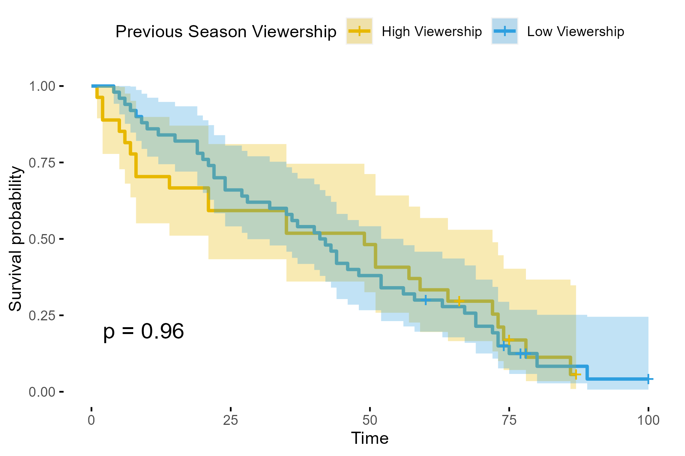

# Alone: Survival Analysis

## Table of Contents
1. Hypothetical Scenario
2. Question
3. Analysis
4. Results and interpretation
5. Next steps
6. Limitations
7. Warning 

## 1. Hypothetical Scenario
[Alone](https://en.wikipedia.org/wiki/Alone_(TV_series)) is a well known american survival show. I wondered about whether intentionally took decisions to reduce or increase the survival rate based on the previous season viewership. This is relevant because it might show whether the show might be fake (if they can alter easily the survival rate, it might mean the rules are not what the show says)  

**Hypotheses:**
- A fake show will would be able to alter easily the survival rate based on the previous season viewership.

**Assumption:**
- Survival rate influences higher or lower views in the current season.

## 2. Question
Is **the previous Season Viewership** associated with the survival rate of the season?

## 3. Analysis
## 3.1 Data
Data were taken from the [Alone data](https://github.com/rfordatascience/tidytuesday/blob/master/data/2023/2023-01-24/readme.md) from the [TidyTuesday repository](https://github.com/rfordatascience/tidytuesday).
## 3.2 Classification
Used a k-means clustering to split the seasons into two groups. I didn't include the Season 1 because it didn't have a previous season, on the other hand, I only used half of the participants in Season 4 to avoid and overstimation since participants teamed up in that season.

## 3.3 Survival Analysis
Applied a Log-rank test to compare the group with high viewership against the low viewership group.

## 4. Results and interpretation
The cluster analysis split the seasons into two groups depending on the previous season viewership:
- High viewership: seasons 2, 3, 4
- Low viewership: seasons 5, 6, 7, 8, 9

The Log-rank test tell shows a p-value of 0.96, it means there's not enough evidence to assure seasons with the highest viewership have a different survival rate to the group with the lowest viewership in their previous seson.  

## 5. Relevance
In this case, negative results are equal important to positive results. The results shows that there's not evidence to say the show is fake due to its survival rates didn't show a changed based on the the previous season viewership. However, I didn't measure other variables that are also reated to the decision made for the show.

